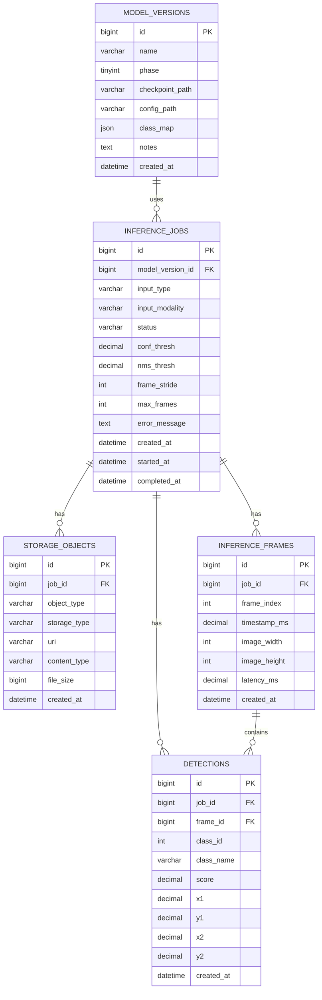

# Database Schema

이 문서는 Dual YOLO 프로젝트의 추론 결과 저장을 위한 1차 데이터베이스 설계 기준이다.
FastAPI 추론 API, 향후 대시보드, 로컬 저장소 또는 S3 저장소 확장을 함께 고려한다.

## 설계 범위

- 이미지 추론 1건과 영상 추론 1건을 모두 `inference_jobs` 기준으로 관리한다.
- 이미지 추론도 `inference_frames`에 `frame_index = 0`, `timestamp_ms = 0.000`으로 저장한다.
- bbox 1개는 `detections` 1행으로 저장한다.
- 입력 파일, 결과 파일, 결과 JSON, 썸네일 등은 `storage_objects`에서 관리한다.
- 어떤 모델 checkpoint로 추론했는지는 `model_versions`에 남긴다.

## ERD



## 공통 규칙

모든 테이블의 기본키는 아래 형식을 사용한다.

```sql
id BIGINT UNSIGNED AUTO_INCREMENT PRIMARY KEY
```

각 테이블의 `id`는 테이블마다 독립적으로 1부터 증가한다.

시간 컬럼은 아래 형식을 기본으로 사용한다.

```sql
created_at DATETIME(6) NOT NULL DEFAULT CURRENT_TIMESTAMP(6)
```

상태값과 타입값은 DB `ENUM` 대신 `VARCHAR`로 저장하고, 애플리케이션에서 허용값을 검증한다.

## 테이블 정의

### model_versions

추론에 사용한 모델 checkpoint와 설정 정보를 저장한다.

| 컬럼 | 타입 | NULL | 기본값 | 설명 |
| --- | --- | --- | --- | --- |
| id | BIGINT UNSIGNED AUTO_INCREMENT | NO | - | 모델 버전 ID |
| name | VARCHAR(100) | NO | - | 모델 버전 이름 |
| phase | TINYINT UNSIGNED | YES | NULL | 학습 phase. 외부 실험 모델은 NULL 가능 |
| checkpoint_path | VARCHAR(1024) | NO | - | checkpoint 경로 |
| config_path | VARCHAR(1024) | YES | NULL | 모델 설정 파일 경로 |
| class_map | JSON | NO | - | 추론 당시 클래스 매핑 |
| notes | TEXT | YES | NULL | 비고 |
| created_at | DATETIME(6) | NO | CURRENT_TIMESTAMP(6) | 생성 시각 |

예시 `class_map`:

```json
{
  "0": "person",
  "1": "boar",
  "2": "deer"
}
```

### inference_jobs

이미지 또는 영상 추론 요청 1건을 저장한다.

| 컬럼 | 타입 | NULL | 기본값 | 설명 |
| --- | --- | --- | --- | --- |
| id | BIGINT UNSIGNED AUTO_INCREMENT | NO | - | 추론 작업 ID |
| model_version_id | BIGINT UNSIGNED | NO | - | 사용 모델 버전 ID |
| input_type | VARCHAR(20) | NO | - | 입력 타입. 예: image, video |
| input_modality | VARCHAR(20) | NO | - | 입력 모달리티. 예: rgb, thermal, pair |
| status | VARCHAR(30) | NO | queued | 작업 상태 |
| conf_thresh | DECIMAL(5,4) | NO | 0.2500 | confidence threshold |
| nms_thresh | DECIMAL(5,4) | NO | 0.4500 | NMS IoU threshold |
| frame_stride | INT UNSIGNED | YES | NULL | 영상 추론 frame stride |
| max_frames | INT UNSIGNED | YES | NULL | 영상 추론 최대 처리 프레임 수 |
| error_message | TEXT | YES | NULL | 실패 사유 |
| created_at | DATETIME(6) | NO | CURRENT_TIMESTAMP(6) | 작업 생성 시각 |
| started_at | DATETIME(6) | YES | NULL | 추론 시작 시각 |
| completed_at | DATETIME(6) | YES | NULL | 추론 완료 시각 |

권장 상태값:

```text
queued
running
completed
failed
```

### storage_objects

입력 파일, 출력 파일, 결과 JSON, 썸네일 등 파일성 객체의 저장 위치를 관리한다.

| 컬럼 | 타입 | NULL | 기본값 | 설명 |
| --- | --- | --- | --- | --- |
| id | BIGINT UNSIGNED AUTO_INCREMENT | NO | - | 저장 객체 ID |
| job_id | BIGINT UNSIGNED | NO | - | 추론 작업 ID |
| object_type | VARCHAR(50) | NO | - | 객체 종류 |
| storage_type | VARCHAR(20) | NO | - | 저장소 타입. 예: local, s3 |
| uri | VARCHAR(1024) | NO | - | 로컬 경로, S3 URI, URL |
| content_type | VARCHAR(100) | YES | NULL | MIME type |
| file_size | BIGINT UNSIGNED | YES | NULL | 파일 크기 byte |
| created_at | DATETIME(6) | NO | CURRENT_TIMESTAMP(6) | 생성 시각 |

권장 `object_type`:

```text
input_rgb
input_thermal
output_image
output_video
result_json
thumbnail
```

### inference_frames

영상의 처리 프레임 단위 결과를 저장한다. 이미지 추론도 동일 구조로 저장한다.

| 컬럼 | 타입 | NULL | 기본값 | 설명 |
| --- | --- | --- | --- | --- |
| id | BIGINT UNSIGNED AUTO_INCREMENT | NO | - | 프레임 ID |
| job_id | BIGINT UNSIGNED | NO | - | 추론 작업 ID |
| frame_index | INT UNSIGNED | NO | - | 원본 영상 기준 프레임 번호. 이미지는 0 |
| timestamp_ms | DECIMAL(12,3) | NO | - | 영상 타임스탬프 ms. 이미지는 0.000 |
| image_width | INT UNSIGNED | NO | - | 입력 이미지 또는 프레임 너비 |
| image_height | INT UNSIGNED | NO | - | 입력 이미지 또는 프레임 높이 |
| latency_ms | DECIMAL(10,3) | YES | NULL | 해당 프레임 추론 시간 ms |
| created_at | DATETIME(6) | NO | CURRENT_TIMESTAMP(6) | 생성 시각 |

### detections

탐지 bbox 1개를 1행으로 저장한다.

| 컬럼 | 타입 | NULL | 기본값 | 설명 |
| --- | --- | --- | --- | --- |
| id | BIGINT UNSIGNED AUTO_INCREMENT | NO | - | 탐지 결과 ID |
| job_id | BIGINT UNSIGNED | NO | - | 추론 작업 ID |
| frame_id | BIGINT UNSIGNED | NO | - | 프레임 ID |
| class_id | INT UNSIGNED | NO | - | 클래스 ID |
| class_name | VARCHAR(50) | NO | - | 추론 당시 클래스 이름 |
| score | DECIMAL(6,5) | NO | - | confidence score |
| x1 | DECIMAL(10,3) | NO | - | bbox 좌상단 x 픽셀 좌표 |
| y1 | DECIMAL(10,3) | NO | - | bbox 좌상단 y 픽셀 좌표 |
| x2 | DECIMAL(10,3) | NO | - | bbox 우하단 x 픽셀 좌표 |
| y2 | DECIMAL(10,3) | NO | - | bbox 우하단 y 픽셀 좌표 |
| created_at | DATETIME(6) | NO | CURRENT_TIMESTAMP(6) | 생성 시각 |

bbox 좌표는 정규화 좌표가 아니라 입력 이미지 또는 프레임 기준 픽셀 좌표로 저장한다.

## 주요 컬럼 설명

이 섹션은 물리 ERD 작성자가 각 컬럼의 의미를 빠르게 이해할 수 있도록, 헷갈리기 쉬운 컬럼을 서비스 흐름 기준으로 설명한다.

### model_versions

`name`은 모델을 사람이 구분하기 위한 이름이다.
예를 들어 `phase3_gop_best_20260623`, `experiment_llvip_phase2_v1`처럼 학습 phase, 데이터셋, 실험명을 함께 포함하면 좋다.

`phase`는 프로젝트 학습 단계와 연결된다.
`1`, `2`, `3`은 각각 phase1, phase2, phase3 학습 모델을 의미한다.
외부 실험 코드에서 만든 모델이거나 phase 구분이 애매한 모델은 `NULL`로 둘 수 있다.

`checkpoint_path`는 추론에 사용할 모델 가중치 파일 위치다.
초기 로컬 개발에서는 `checkpoints/phase3/best.pt` 같은 로컬 경로를 저장하고, 운영 환경에서 S3를 사용하면 `s3://bucket/path/best.pt` 같은 URI를 저장할 수 있다.

`config_path`는 모델 설정 파일 위치다.
현재 프로젝트에서는 `configs/model.yaml` 같은 설정 파일을 가리킬 수 있고, 설정 파일 없이 checkpoint만 관리하는 외부 모델이면 `NULL`로 둘 수 있다.

`class_map`은 추론 당시의 클래스 ID와 클래스 이름 매핑이다.
현재 프로젝트 기준 기본 매핑은 `0: person`, `1: boar`, `2: deer`이다.
추론 결과에는 `class_id`와 `class_name`을 함께 저장하지만, 모델 버전에도 매핑을 남겨두면 나중에 결과 해석이 안전해진다.

### inference_jobs

`input_type`은 추론 입력의 큰 종류다.
현재 API 기준 허용값은 `image`, `video`이다.

`input_modality`는 모델에 들어간 입력 채널 구성을 의미한다.
`rgb`는 RGB 이미지만 사용한 경우, `thermal`은 thermal/TIR 이미지만 사용한 경우, `pair`는 RGB와 thermal/TIR을 함께 사용한 경우다.

`status`는 추론 작업의 진행 상태다.
`queued`는 작업이 생성된 상태, `running`은 추론이 진행 중인 상태, `completed`는 정상 완료, `failed`는 예외 또는 검증 실패로 완료되지 못한 상태를 의미한다.

`conf_thresh`는 confidence threshold이다.
모델이 예측한 bbox의 confidence score가 이 값보다 낮으면 최종 결과에서 제외한다.
예를 들어 `0.2500`이면 score가 0.25 미만인 탐지 결과는 저장하지 않는다.

`nms_thresh`는 NMS IoU threshold이다.
서로 많이 겹치는 bbox 중 중복된 결과를 제거할 때 사용하는 IoU 기준이다.
값이 낮을수록 겹치는 박스를 더 강하게 제거하고, 값이 높을수록 더 많은 박스가 남을 수 있다.

`frame_stride`는 영상 추론에서 몇 프레임마다 한 번씩 추론할지 나타낸다.
예를 들어 `frame_stride = 5`이면 0, 5, 10, 15번째 프레임처럼 5프레임 간격으로 추론한다.
이미지 추론에서는 사용하지 않으므로 `NULL`로 둔다.

`max_frames`는 영상 추론에서 최대 몇 개의 프레임을 처리할지 제한하는 값이다.
긴 영상을 테스트하거나 API 응답 시간을 제한할 때 사용한다.
제한 없이 처리하는 경우 또는 이미지 추론에서는 `NULL`로 둘 수 있다.

`error_message`는 `status = failed`일 때 실패 원인을 저장한다.
사용자에게 그대로 보여줄 메시지라기보다, 운영자가 로그와 함께 원인을 파악하기 위한 값이다.

### storage_objects

`object_type`은 저장된 파일이 어떤 역할인지 나타낸다.
`input_rgb`는 업로드된 RGB 입력, `input_thermal`은 업로드된 thermal/TIR 입력, `output_image`는 bbox가 그려진 결과 이미지, `output_video`는 bbox가 그려진 결과 영상, `result_json`은 추론 결과 JSON, `thumbnail`은 대시보드 미리보기 이미지로 사용할 수 있다.

`storage_type`은 파일이 저장된 저장소 종류다.
초기 로컬 개발에서는 `local`, 운영 환경에서 S3를 사용하면 `s3`를 저장한다.

`uri`는 실제 파일 위치다.
로컬 저장소를 사용할 때는 `/outputs/inference/result.mp4` 같은 경로가 들어갈 수 있고, S3를 사용할 때는 `s3://bucket/path/result.mp4` 같은 URI가 들어갈 수 있다.

`content_type`은 파일의 MIME type이다.
예를 들어 JPEG 이미지는 `image/jpeg`, MP4 영상은 `video/mp4`, JSON 결과는 `application/json`으로 저장할 수 있다.

`file_size`는 파일 크기 byte 값이다.
필수는 아니지만, 대시보드에서 저장 용량을 확인하거나 업로드 이상 여부를 점검할 때 유용하다.

### inference_frames

`frame_index`는 원본 영상 기준 프레임 번호다.
예를 들어 `frame_stride = 5`로 추론하면 저장되는 `frame_index`는 0, 5, 10처럼 원본 영상의 프레임 번호를 유지한다.
이미지 추론은 단일 프레임처럼 취급해서 `0`을 저장한다.

`timestamp_ms`는 원본 영상 기준 시간 위치를 ms 단위로 저장한 값이다.
예를 들어 10 FPS 영상의 5번째 프레임이면 약 `500.000`ms가 될 수 있다.
이미지 추론은 시간 개념이 없으므로 `0.000`을 저장한다.

`image_width`, `image_height`는 원본 입력 이미지 또는 원본 영상 프레임의 크기다.
모델 내부 전처리 크기가 아니라, API 응답과 bbox 좌표를 해석할 때 기준이 되는 원본 크기를 저장한다.

`latency_ms`는 해당 이미지 또는 프레임 하나를 추론하는 데 걸린 시간이다.
성능 모니터링과 병목 확인에 사용한다.

### detections

`job_id`와 `frame_id`를 함께 저장한다.
`frame_id`만 있어도 어떤 job의 결과인지 역으로 찾을 수 있지만, 대시보드에서 특정 job의 전체 bbox를 빠르게 조회하기 위해 `job_id`를 중복 저장한다.

`class_id`는 모델이 출력한 클래스 번호이고, `class_name`은 추론 당시 그 번호에 대응되는 클래스 이름이다.
클래스 매핑이 나중에 바뀌더라도 과거 결과를 안전하게 해석하기 위해 둘 다 저장한다.

`score`는 해당 bbox에 대한 모델의 confidence score이다.
`conf_thresh`를 통과한 결과만 저장하는 것이 기본이다.

`x1`, `y1`, `x2`, `y2`는 bbox의 픽셀 좌표다.
`x1`, `y1`은 좌상단 좌표이고 `x2`, `y2`는 우하단 좌표다.
전처리된 640x640 기준이 아니라, API 응답과 동일하게 원본 입력 이미지 또는 원본 영상 프레임 크기 기준으로 저장한다.

## FK 정책

```text
inference_jobs.model_version_id -> model_versions.id
storage_objects.job_id -> inference_jobs.id
inference_frames.job_id -> inference_jobs.id
detections.job_id -> inference_jobs.id
detections.frame_id -> inference_frames.id
```

권장 삭제 정책:

```text
inference_jobs.model_version_id: ON DELETE RESTRICT
storage_objects.job_id: ON DELETE CASCADE
inference_frames.job_id: ON DELETE CASCADE
detections.job_id: ON DELETE CASCADE
detections.frame_id: ON DELETE CASCADE
```

모델 버전은 추론 결과의 근거이므로, 해당 모델을 사용한 추론 결과가 남아 있으면 삭제하지 않는다.
반대로 추론 job을 삭제하면 그 job의 파일 기록, 프레임 기록, bbox 결과는 함께 삭제한다.

## 보조 인덱스

아래 인덱스는 `id` 증가 방식과 별개인 조회 성능용 보조 색인이다.

### model_versions

```sql
INDEX idx_model_versions_phase (phase),
INDEX idx_model_versions_created_at (created_at)
```

### inference_jobs

```sql
INDEX idx_jobs_model_version_id (model_version_id),
INDEX idx_jobs_status_created_at (status, created_at),
INDEX idx_jobs_input_type_created_at (input_type, created_at),
INDEX idx_jobs_input_modality_created_at (input_modality, created_at),
INDEX idx_jobs_created_at (created_at)
```

### storage_objects

```sql
INDEX idx_storage_job_id (job_id),
INDEX idx_storage_object_type (object_type)
```

### inference_frames

```sql
INDEX idx_frames_job_frame (job_id, frame_index),
INDEX idx_frames_job_timestamp (job_id, timestamp_ms)
```

### detections

```sql
INDEX idx_detections_job_id (job_id),
INDEX idx_detections_frame_id (frame_id),
INDEX idx_detections_class_score (class_id, score),
INDEX idx_detections_job_class (job_id, class_id)
```

## 향후 확장 후보

1차 설계에서는 추론 결과 저장에 집중하고, 아래 항목은 서비스 요구사항이 구체화된 뒤 추가한다.

- `users`: 사용자, 관리자, 팀원 계정 관리
- `cameras`: 실제 설치 카메라 또는 영상 source 관리
- `alerts`: 위험 객체 탐지 알림 이력
- `tracking_objects`: 영상 내 객체 tracking ID 관리
- `training_runs`: 학습 실행 이력, metric, checkpoint 관리
